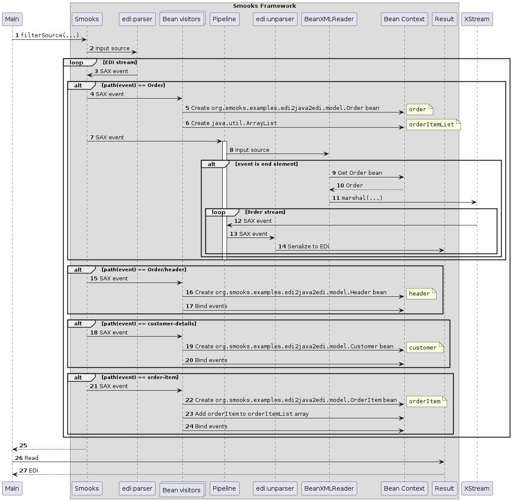

About
=====

This example extends the [`edi-to-java`](../edi-to-java) example. After the EDI data is bound to the JavaBean object graph, a [pipeline](https://www.smooks.org/documentation/#pipeline) reader called `BeanXMLReader` marshals the graph to SAX events using [XStream](https://x-stream.github.io/). The pipeline feeds the XStream generated event stream to `edi:unparser`. The EDI visitor serialises each event in the stream to its EDI counterpart and writes the output to the pipeline execution result. The pipeline result becomes the result of the Smooks execution thanks to the `replace` pipeline directive.

### How to run?

1. `mvn clean package`
2. `mvn exec:exec`

### UML Sequence Diagram

